<div align="center">



<br/>


**Bộ skill engineering cá nhân — backup &amp; đồng bộ nhiều máy.**
Một repo vừa là **kho lưu trữ**, vừa là **Claude Code marketplace + plugin** và **Codex CLI skills** — cài lại trong 2 lệnh.


</div>

## ⚡ Có gì bên trong

> 🛠️ **Skill tự tạo** — chế riêng cho phong cách dev của mình: automation, Electron, proxy, game tu tiên, Firebase.

| | Skill | Tác dụng |
|:--:|:--|:--|
| 🧭 | **ecc** | Hub điều phối 286 engineering pattern, tự route theo domain (automation / frontend / backend / devops / game / quality / patterns) |
| 📚 | **source-driven** | Chống AI bịa API/SDK bên thứ 3 — verify từ doc chính thức trước khi code (Firebase v8/v9, Playwright, Telegram, mail.tm, SMM, Electron Builder, OpenAI/Anthropic) |
| 🎯 | **risk-first** | Build feature mới: làm mẩu **rủi ro nhất trước** + vertical slice + save point |
| 🔎 | **trace-log** | Structured JSON log + correlation ID cho hệ chạy song song (AM Proxy, bot worker pool) |
| 🌐 | **IMOL2o** | Dựng website **đỉnh cao &amp; đẹp chuẩn 2026** — thẩm mỹ (bento/aurora/OKLCH), stack frontend (Astro/Next/SvelteKit), cinematic 3D/WebGPU, motion, AI workflow |
| 🎮 | **game-studio** | Hệ thống phát triển game toàn diện chuyển thể từ Claude Code Game Studios (CCGS): 7-phase pipeline, GDD, Game Feel & The Juice, Godot/Unity/Unreal/Web Canvas |
| 🎨 | **canvas-game-art** | Dựng đồ họa & hoạt ảnh Web Game Canvas 2D mượt mà 60 FPS bằng code thuần: Procedural Pixel Art, Chibi generator, walking bobbing 4-frame, cartoon outline, LRU cache |
| 🛡️ | **security-review** | Rà soát bảo mật & pentest toàn diện: OWASP Top 10 + Agentic Top 10, chống SQLi, IDOR, XSS, CSRF, brute-force, bảo vệ secrets |

> 🎨 **Skill tải về** — đồ hay của cộng đồng, gom chung cho tiện sync.

| | Skill | Tác dụng |
|:--:|:--|:--|
| 🖼️ | **baoyu-design** | Tạo UI mockup / prototype / slide deck HTML |
| 🌌 | **cinematic-3d-web** | Three.js / WebGL site cinematic kiểu *awwwards* |
| 🔬 | **deep-research** | Deep research đa nguồn, có verify + cite |
| 🖼️ | **create-image** | Tạo ảnh AI (FLUX API) hoặc programmatic (Pillow/SVG/NumPy) |
| 🔁 | **web-clone** | Clone/reproduce website — real-source-first decision tree + 12 scripts Playwright (recon, visual-diff, design-dna); L1–L6 complexity |

> 🤖 **Sub-agents** — 9 chuyên gia chạy độc lập (context riêng, tool riêng), dùng được mọi project.

| | Agent | Vai trò |
|:--:|:--|:--|
| 🔬 | **researcher** | Deep research đa nguồn trước khi quyết kỹ thuật |
| 🏗️ | **architect** | Kiến trúc hệ thống, data model, trade-off |
| 💻 | **senior-dev** | Code production-ready React/Node/Python/Electron |
| 🎨 | **frontend-ux** | UI Tailwind, 4 trạng thái, a11y, Core Web Vitals |
| 🤖 | **automation-engineer** | Playwright, login-bot, OTP, multi-acc, anti-bot |
| 📦 | **devops-builder** | Electron Builder, PyInstaller, .exe, installer |
| 🔍 | **debugger** | Root cause analysis, stack trace, không vá triệu chứng |
| ✅ | **qa-tester** | Unit test, kịch bản manual khắt khe, regression |
| 👁️ | **code-reviewer** | Soi bug + lộ key/token, chỉ đọc & báo cáo |

📌 Kèm references:
- [`reference/working-discipline.md`](reference/working-discipline.md) — **11 nguyên tắc làm việc** để dán vào `CLAUDE.md`
- [`reference/claude-md-optimization.md`](reference/claude-md-optimization.md) — **Lazy-load pattern** giảm 57% input tokens/session


## 🚀 Hướng dẫn cài đặt

---

### 🧠 Claude Code CLI

<div align="center">

</div>

#### Bước 1: Clone repo

```bash
git clone https://github.com/xomno01/luuvanskill.git
```

#### Bước 2: Cài agents & skills

Chọn **một trong hai cách** — cả hai đều hỗ trợ auto-invoke:

**Cách A — Plugin** (namespace `/luuvanskill:*`, gọn nhất):

```bash
# Trong Claude Code CLI:
/plugin marketplace add xomno01/luuvanskill
/plugin install luuvanskill
/reload-plugins
```

Sau khi cài, gọi thủ công bằng `/luuvanskill:ecc`, `/luuvanskill:senior-dev`, v.v.

**Cách B — Copy trực tiếp** (giữ tên ngắn `/ecc`, khuyến nghị):

```bash
cp -r luuvanskill/agents/* ~/.claude/agents/
cp -r luuvanskill/skills/* ~/.claude/skills/
```

> Skills xuất hiện ngay dưới tên gốc: `/ecc`, `/source-driven`, `/risk-first`, `/trace-log`

#### Bước 3: Xác nhận

```bash
# Trong Claude Code, kiểm tra:
/skills     # → thấy ecc, source-driven, risk-first, trace-log, ...
/agents     # → thấy researcher, architect, senior-dev, ...
```

---

#### 🤖 Auto-invoke — không cần gõ gì thêm

> Claude đọc trường `description` trong mỗi `agent/*.md` → khi task của anh khớp → **tự spawn agent đúng**.

| Anh nói gì | Agent tự kích hoạt |
|:--|:--|
| "viết Playwright login bot", "OTP Hotmail", "multi-account" | `automation-engineer` |
| "build .exe", "Electron Builder", "PyInstaller", "installer" | `devops-builder` |
| "React UI", "Tailwind", "dark mode", "skeleton loader", "a11y" | `frontend-ux` |
| "Node.js API", "Firebase", "backend service", "rate limit" | `senior-dev` |
| "review code", "tìm bug", "lộ API key", "security check" | `code-reviewer` |
| "tại sao crash", "stack trace", "debug", "root cause" | `debugger` |
| "thiết kế kiến trúc", "data model", "Firebase schema", "trade-off" | `architect` |
| "viết test", "kịch bản manual", "regression check" | `qa-tester` |
| "tìm hiểu thư viện", "compare tool", "research API" | `researcher` |

**Skill auto-invoke** (chạy ngầm, không cần gọi tay):

| Tình huống | Skill tự bắn |
|:--|:--|
| Đụng SDK bên thứ 3 (Firebase, Playwright, Telegram, Electron Builder...) | `source-driven` — verify doc trước khi code |
| Feature mới nhiều mảnh có chỗ chưa chắc khả thi | `risk-first` — làm mẩu rủi ro nhất trước |
| Hệ chạy song song (worker pool, bot nhiều acc, proxy forward) | `trace-log` — structured log + correlation ID |

---

### ⚡ OpenAI Codex CLI

<div align="center">

</div>

#### Bước 1: Cài 13 skills (1 lệnh)

```bash
git clone https://github.com/xomno01/luuvanskill.git
bash luuvanskill/codex/install.sh
```

Output mẫu:

```
=== luuvanskill Codex Install ===
[OK] ~/.codex/AGENTS.md
[OK] ~/.agents/skills/ecc/SKILL.md
[OK] ~/.agents/skills/source-driven/SKILL.md
[OK] ~/.agents/skills/risk-first/SKILL.md
[OK] ~/.agents/skills/trace-log/SKILL.md
[OK] ~/.agents/skills/architect/SKILL.md
[OK] ~/.agents/skills/senior-dev/SKILL.md
... (13 skills total)

Done! 13 skills installed.
Invoke with: $skill-name (e.g. $ecc, $senior-dev, $debugger)
```

Script tự copy:
- `codex/AGENTS.md` → `~/.codex/AGENTS.md` — global instructions, tương đương `CLAUDE.md`
- `codex/skills/*/SKILL.md` → `~/.agents/skills/*/SKILL.md` — 13 skills (4 core + 9 persona)

#### Bước 2: Chạy và gọi skill

```bash
codex          # mở Codex, gõ prompt bình thường
$ecc           # gọi skill ecc thủ công
$senior-dev    # gọi skill senior-dev
$debugger      # gọi skill debugger
$researcher    # deep research
```

> **Codex tự nhận task** — nếu task khớp description của skill, Codex tự đọc `SKILL.md` đúng mà không cần gõ `$`.

**Danh sách 13 skills:**

| Nhóm | Skill | Gọi bằng |
|:--|:--|:--|
| Core | ecc, source-driven, risk-first, trace-log | `$ecc`, `$source-driven`, ... |
| Persona | architect, senior-dev, frontend-ux, automation-engineer | `$architect`, `$senior-dev`, ... |
| Persona | devops-builder, debugger, qa-tester, researcher, code-reviewer | `$devops-builder`, `$debugger`, ... |
| Công cụ | web-clone | `$web-clone` |

---

#### 🔀 Chạy nhiều project song song — `codex-isolated.bat`

Codex CLI có bug đã biết ([#11435](https://github.com/openai/codex/issues/11435), [#24224](https://github.com/openai/codex/issues/24224)): khi 2+ project cùng chạy, shared `~/.codex/` state bị **leak giữa sessions** → Codex hiểu sai context hoặc không nhận đúng config.

**`codex-isolated.bat`** giải quyết bằng cách tạo `CODEX_HOME` riêng cho mỗi project:

```batch
# Thay vì dùng: codex
# Dùng:         codex-isolated.bat [tên-project]

cd C:\Projects\alpha
codex-isolated.bat alpha
# → CODEX_HOME: C:\Users\<you>\.codex-sessions\alpha\

cd C:\Projects\beta
codex-isolated.bat beta
# → CODEX_HOME: C:\Users\<you>\.codex-sessions\beta\
```

Mỗi lần chạy, bat tự sync `config.toml`, `auth.json`, `installation_id`, `AGENTS.md` từ `~/.codex/` vào CODEX_HOME mới — đảm bảo dùng config mới nhất mà không bị nhiễm bởi session khác.

**Cài vào PATH (chạy từ bất kỳ đâu):**

```cmd
copy luuvanskill\codex\codex-isolated.bat %WINDIR%\
```

**Sơ đồ trước / sau:**

```
❌ Không có isolation — sessions xung đột:
  Project Alpha ──┐
                  ├──▶  ~/.codex/  (shared state)  ──▶ conflict!
  Project Beta  ──┘

✅ Với codex-isolated.bat — mỗi project độc lập:
  Project Alpha ──▶  ~/.codex-sessions/alpha/  ──▶ OK
  Project Beta  ──▶  ~/.codex-sessions/beta/   ──▶ OK

  ~/.agents/skills/  vẫn dùng chung (read-only, an toàn)
```

**Cú pháp đầy đủ:**

```batch
codex-isolated.bat                         # tên = thư mục hiện tại
codex-isolated.bat my-project              # đặt tên tùy ý
codex-isolated.bat my-project "fix bug"    # non-interactive (prompt trực tiếp)
```

---

**So sánh Claude Code vs Codex CLI:**

| | Claude Code | Codex CLI |
|:--|:--|:--|
| Agents | `~/.claude/agents/*.md` (9 agents, context riêng) | Port thành skills `~/.agents/skills/` |
| Skills | `~/.claude/skills/*/SKILL.md` | `~/.agents/skills/*/SKILL.md` |
| Global instructions | `~/.claude/CLAUDE.md` | `~/.codex/AGENTS.md` |
| Model config | `model:` trong frontmatter agent | Codex profiles (`--profile`) |
| Auto-invoke | `description` field trong agent/skill | `description` field trong SKILL.md |
| Gọi thủ công | `/skill-name` hoặc `@agent-name` | `$skill-name` |
| Parallel isolation | Native | `codex-isolated.bat` (thư mục này) |


## 🔄 Đồng bộ &amp; cập nhật

```bash
# Máy chính: sửa skill rồi đẩy lên
git commit -am "update skill" && git push

# Máy khác: kéo bản mới (Claude Code)
/plugin marketplace update
/plugin update luuvanskill

# Máy khác: kéo bản mới (Codex CLI)
git pull && bash codex/install.sh
```

## 🧭 11 nguyên tắc làm việc

Lọc từ bộ [`addyosmani/agent-skills`](https://github.com/addyosmani/agent-skills) cho **dev solo** — bỏ nghi thức team enterprise.
Nêu giả định trước khi code · scope discipline · risk-first · verify API bên thứ 3 · prove-it bug · validate input · save point · refactor an toàn · secrets vào `.env` · structured log · ADR-lite.

→ Chi tiết: [`reference/working-discipline.md`](reference/working-discipline.md)

## 🗂️ Cấu trúc repo

```text
luuvanskill/
├── .claude-plugin/
│   ├── plugin.json          # manifest plugin
│   └── marketplace.json     # catalog marketplace (source ./)
├── skills/                  # 9 skill Claude Code, mỗi cái 1 thư mục có SKILL.md
│   ├── ecc/  source-driven/  risk-first/  trace-log/  IMOL2o/
│   ├── baoyu-design/  cinematic-3d-web/  deep-research/  create-image/  web-clone/
├── agents/                  # 9 sub-agent Claude Code (copy → ~/.claude/agents/)
│   ├── TEAM.md              # sơ đồ team + hướng dẫn dispatch
│   ├── architect.md  senior-dev.md  frontend-ux.md  automation-engineer.md
│   ├── devops-builder.md  debugger.md  qa-tester.md  researcher.md
│   └── code-reviewer.md
├── codex/                   # OpenAI Codex CLI port
│   ├── AGENTS.md            # global instructions (tương đương CLAUDE.md)
│   ├── install.sh           # script cài 1 lệnh — copy vào ~/.agents/skills/
│   ├── codex-isolated.bat   # fix parallel session bug — CODEX_HOME per project
│   └── skills/              # 13 skills (4 core + 9 persona), gọi bằng $skill-name
│       ├── ecc/  source-driven/  risk-first/  trace-log/
│       ├── architect/  senior-dev/  frontend-ux/  automation-engineer/
│       ├── devops-builder/  debugger/  qa-tester/  researcher/
│       └── code-reviewer/
├── reference/
│   ├── working-discipline.md      # 11 nguyên tắc (verbose, để tham chiếu)
│   └── claude-md-optimization.md  # lazy-load pattern giảm 57% tokens
└── assets/                        # pixel-art + terminal animation SVGs
    ├── hero.svg                   # banner chính (pixel font animation)
    ├── divider.svg                # divider decorative
    ├── claude-install.svg         # animated Claude Code install guide ← NEW
    └── codex-install.svg          # animated Codex CLI install guide ← NEW
```

<div align="center">


<sub>🔒 Private repo · backup cá nhân, không phát hành công khai · made with <b>Claude Code</b> + pixel ✦</sub>

</div>
