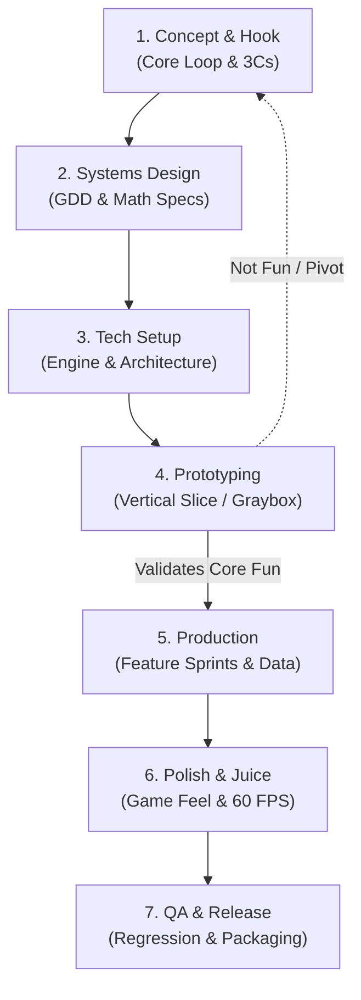

# Quy Trình Phát Triển Game (Game Development Pipeline)

> Chuyển thể từ 7-phase pipeline của Claude Code Game Studios, tinh gọn cho nhịp độ làm việc thực chiến.

---

## 7 Giai Đoạn Dự Án



---

### Phase 1: Concept & Core Loop (Định hình hạt nhân)
* **Câu hỏi then chốt:** Game này có gì đặc sắc trong 10 giây đầu tiên?
* **Xác định 3Cs:**
  * **Character:** Nhân vật là ai, có thuộc tính gì?
  * **Control:** Điều khiển phản hồi thế nào (nhạy, trễ, quán tính)?
  * **Camera:** Góc nhìn nào (Top-down, Side-scroller, Isometric, First-person)?
* **Core Loop cơ bản:**
  * *Ví dụ Tu Tiên:* `Thu thập linh khí -> Đột phá cảnh giới -> Khiêu chiến bí cảnh -> Nhận pháp bảo/công pháp`.
  * *Ví dụ Roguelike:* `Vào phòng -> Né đòn & Tiêu diệt quái -> Nhặt nâng cấp ngẫu nhiên -> Chết hoặc qua ải`.

---

### Phase 2: Systems Design (Thiết kế hệ thống & GDD)
* Viết **Game Design Document (GDD)** với 8 mục chuẩn:
  1. **Overview:** Thể loại, nền tảng, phong cách chơi.
  2. **Player Fantasy:** Trải nghiệm cảm xúc người chơi hướng tới.
  3. **Detailed Rules:** Cơ chế cụ thể (di chuyển, va chạm, hồi máu, skill).
  4. **Formulas & Math:** Công thức toán học (sát thương, giáp, kinh nghiệm, drop rate).
  5. **Edge Cases:** Khi máu âm, khi 2 hiệu ứng chồng nhau, khi disconnect / pause.
  6. **Dependencies:** Quan hệ giữa các hệ thống (Combat phụ thuộc vào Inventory, Inventory phụ thuộc vào Database).
  7. **Tuning Knobs:** Bảng biến số để cân bằng mà không cần sửa code.
  8. **Acceptance Criteria:** Tiêu chí nghiệm thu rõ ràng để test pass/fail.

---

### Phase 3: Technical Setup (Kiến trúc & Hạ tầng)
* Chọn Engine phù hợp với quy mô:
  * **Godot 4:** Lựa chọn số 1 cho 2D, indie, nhẹ, khởi động tức thì, GDScript / C#.
  * **Unity:** Thích hợp cho 2D/3D đa nền tảng, asset store lớn, hệ sinh thái C#.
  * **Unreal Engine 5:** Game 3D nặng, đồ họa cinematic, sử dụng C++ và Gameplay Ability System (GAS).
  * **Phaser / Pixi / Three.js / Canvas:** Web game chạy trên trình duyệt, không cần cài đặt engine, nhúng được vào Electron app.
* Thiết lập cấu trúc thư mục sạch:
  ```text
  my-game/
  ├── assets/          # Sprites, audio, shaders, fonts
  ├── config/          # Data files, balance JSON/YAML, tables
  ├── src/
  │   ├── core/        # Game loop, state machine, event bus
  │   ├── gameplay/    # Player, enemies, combat, items
  │   ├── ui/          # HUD, menus, popups (decoupled)
  │   └── systems/     # Save/load, audio manager, pool manager
  ├── tests/           # Unit tests & regression suites
  └── prototypes/      # Throwaway experiments
  ```

---

### Phase 4: Prototyping & Vertical Slice (Kiểm chứng lối chơi)
* **Quy tắc Prototype (Relaxed Rules):**
  * Được phép dùng placeholder art (hình vuông, hình tròn, màu đơn sắc).
  * Được phép dùng âm thanh tạm hoặc tắt tiếng.
  * Được phép viết code nhanh để kiểm chứng xem core loop có **VUI (FUN)** không.
* **Vertical Slice:** Cắt một lát hoàn chỉnh nhỏ nhất (1 màn chơi, 1 nhân vật, 2 loại quái, 1 boss) để đánh giá chất lượng thực tế.
* *Nếu prototype không vui: Dừng lại và pivot ngay lập tức. Đừng bỏ công vẽ hình đẹp cho một gameplay chán!*

---

### Phase 5: Production (Sản xuất tính năng & Tách biệt dữ liệu)
* Chuyển code từ prototype sang code chuẩn Production:
  * Đưa toàn bộ chỉ số sang Data Assets / Config Files.
  * Tách UI độc lập với logic bằng Signal/Event.
  * Sử dụng Object Pooling cho đạn, hiệu ứng, quái spawn nhiều lần (tránh Garbage Collection giật lag).

---

### Phase 6: Polish & The Juice (Độ mượt & Phản hồi)
* 80% cảm xúc của game nằm ở khâu Polish:
  * **Screen shake:** Rung màn hình khi nhận sát thương lớn hoặc đánh chí mạng.
  * **Hitstop (Freeze frame):** Dừng khung hình 0.03 - 0.08 giây khi kiếm chém trúng quái.
  * **Audio Cues:** Âm thanh va chạm, tiếng lách cách khi nhặt đồ, nhạc nền chuyển trạng thái khi vào combat.
  * **Squash & Stretch:** Biến dạng nhẹ nhân vật khi nhảy và khi tiếp đất.
  * **Coyote Time & Input Buffering:** Cho phép nhảy sau khi rời mép đất 0.1s, và nhận lệnh bấm phím trước khi chạm đất 0.1s.

---

### Phase 7: QA, Balancing & Packaging (Kiểm thử & Đóng gói)
* Chạy regression test cho các bug từng phát hiện.
* Thử nghiệm phá hoại (Edge case testing): Spreading input, save đột ngột giữa trận đấu, tài nguyên âm, tràn số nguyên.
* Áp dụng **Giao thức Cặp đôi tác chiến** (1 Lead + 1 Tester Subagent) rà soát lỗ hổng logic.
* Build & xuất file thực thi (`.exe`, HTML5 web build, APK) và profile FPS đảm bảo luôn ổn định ở mức 60 FPS hoặc 120 FPS.
